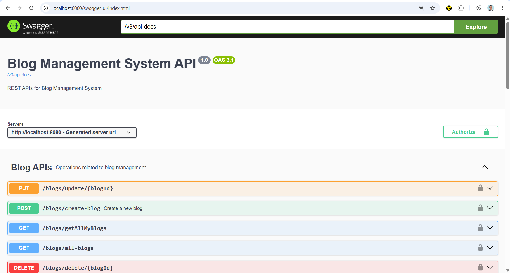
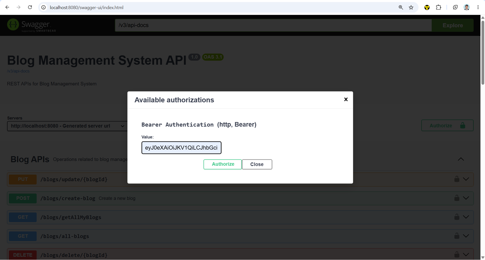
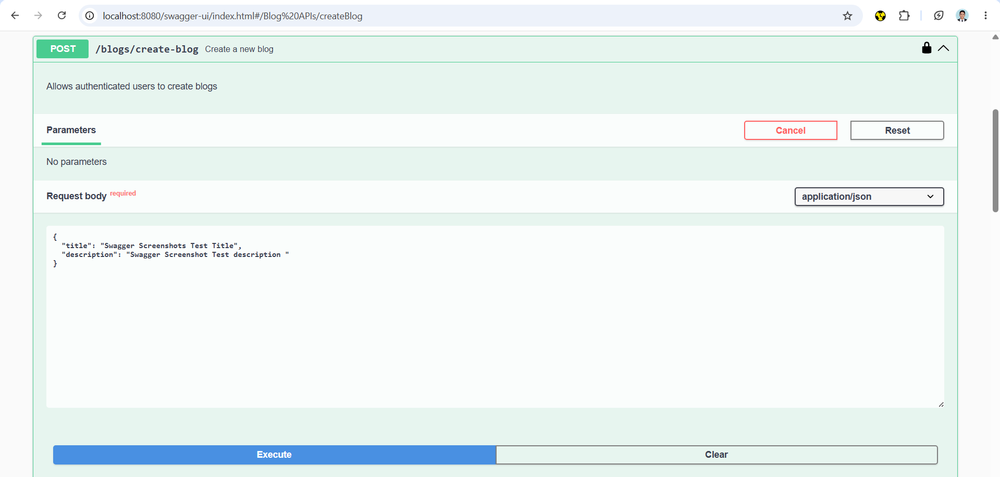
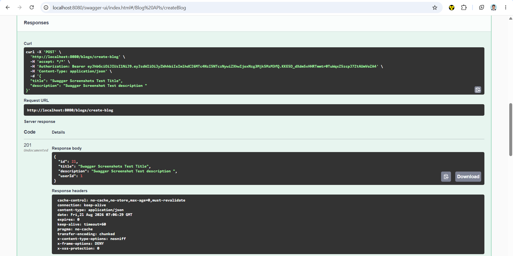
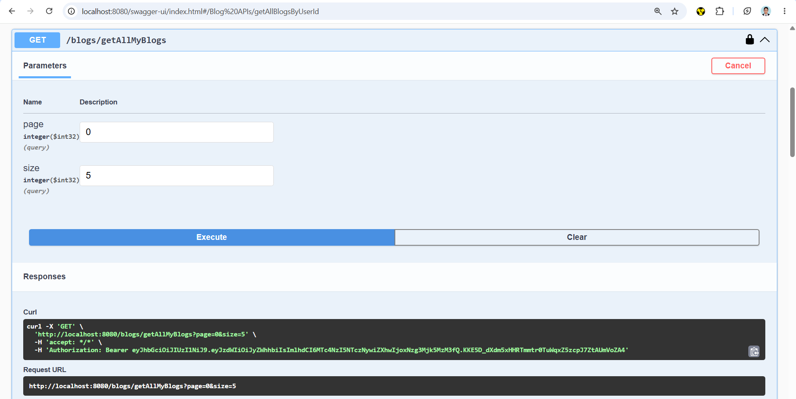
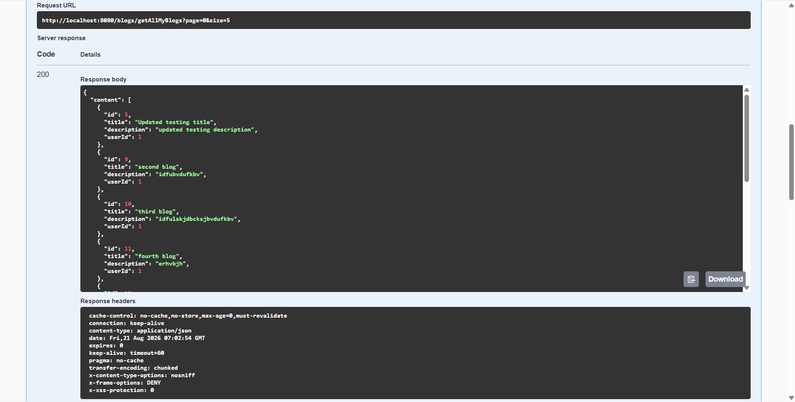
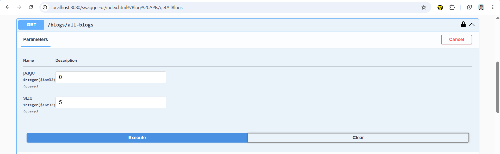
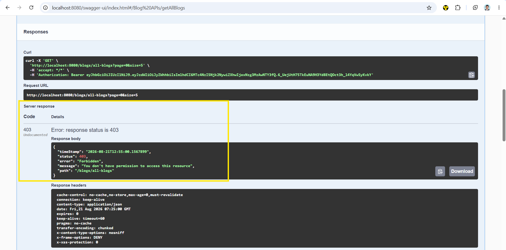
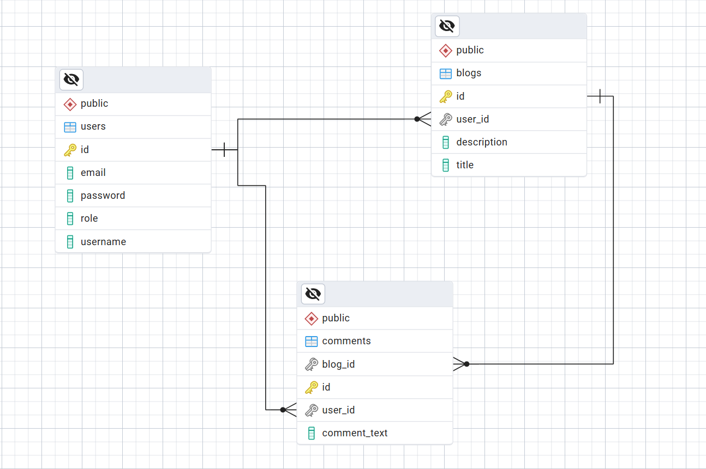

# Blog Management System API

## Overview

A secure and scalable **Blog Management System REST API** built using **Spring Boot**, following industry-standard backend development practices.

The application enables users to create and manage blogs, interact through comments, and access resources based on their roles and permissions. It incorporates modern authentication and authorization mechanisms, API documentation, exception handling, and pagination.

This project was developed to gain hands-on experience with real-world backend development concepts such as Spring Security, JWT Authentication, OAuth2 Login, Role-Based Access Control (RBAC), JPA/Hibernate, and RESTful API design.

---

## Key Features

### Authentication & Security

* JWT Authentication
* Google OAuth2 Authentication
* BCrypt Password Encryption
* Spring Security Integration
* Stateless Authentication
* Protected REST Endpoints

### Authorization

* Role-Based Access Control (RBAC)
* Permission-Based Authorization
* Ownership-Based Resource Access
* Admin and User Roles

### Blog Management

* Create Blog
* Update Blog
* Delete Blog
* Get Blog By ID
* Get All Blogs
* Get Authenticated User Blogs

### Comment Management

* Create Comment
* Update Comment
* Delete Comment
* Get Comments By Blog
* Get Authenticated User Comments

### User Management

* User Registration
* Admin Registration
* View All Users (Admin Only)

### API Enhancements

* Pagination Support
* Global Exception Handling
* DTO-Based Request & Response Structure
* Swagger / OpenAPI Documentation
* Validation Using Jakarta Validation

---


## Application Screenshots

### Swagger API Documentation

Shows all documented REST APIs with JWT Authentication support.



---

### JWT Authentication in Swagger

Demonstrates secured API testing directly from Swagger UI using Bearer Token authentication.



---

### Create Blog API

Example of creating a blog using a secured endpoint.




---

### Blog Pagination

Paginated retrieval of blogs using Spring Data JPA Pageable.





---

### Global Exception Handling

Standardized error responses returned by the API.




---

### Database Schema

Database structure illustrating relationships between Users, Blogs, and Comments.




## Tech Stack

### Backend

* Java 21
* Spring Boot
* Spring Security
* Spring Data JPA
* Hibernate

### Database

* MySQL

### Authentication

* JWT (JSON Web Token)
* Google OAuth2

### Documentation

* Swagger OpenAPI 3

### Utilities

* Lombok
* ModelMapper

### Build Tool

* Maven

---

## Project Architecture

```text
Controller Layer
       │
       ▼
Service Layer
       │
       ▼
Repository Layer
       │
       ▼
    Database
```

The project follows a layered architecture to maintain separation of concerns and improve maintainability.

---

## Security Implementation

### JWT Authentication Flow

```text
User Login
    │
    ▼
Authenticate Credentials
    │
    ▼
Generate JWT Token
    │
    ▼
Send Token To Client
    │
    ▼
Client Sends Token
In Authorization Header
    │
    ▼
JwtAuthFilter Validates Token
    │
    ▼
Access Granted
```

### Roles

```text
ADMIN
USER
```

### Permissions

```text
BLOG_READ
BLOG_WRITE
BLOG_DELETE
```

### Authorization Strategy

* Users can update and delete only their own blogs.
* Users can update and delete only their own comments.
* Admins can manage resources across the platform.
* Ownership checks are enforced at the service layer.

---

## API Documentation

Swagger UI is integrated for interactive API documentation.

### Swagger URL

```text
http://localhost:8080/swagger-ui/index.html
```

### OpenAPI Specification

```text
http://localhost:8080/v3/api-docs
```

Features:

* JWT Authorization Support
* API Grouping with Tags
* Request/Response Documentation
* Interactive API Testing

---

## Pagination

Implemented on the following endpoints:

* Get All Blogs
* Get My Blogs
* Get Comments By Blog
* Get My Comments
* Get All Users

Example:

```http
GET /blogs?page=0&size=10
```

---

## Exception Handling

A centralized exception handling mechanism has been implemented using:

```text
@RestControllerAdvice
```

Handled Exceptions:

* Resource Not Found
* Validation Errors
* Access Denied
* Authentication Failures
* Generic Runtime Exceptions

Example Response:

```json
{
  "timestamp": "2026-08-21T12:30:00",
  "message": "Blog with id 10 not found",
  "status": 404
}
```

---

## Implemented Spring Security Concepts

* AuthenticationManager
* UserDetailsService
* UserDetails
* PasswordEncoder
* JwtAuthFilter
* SecurityFilterChain
* Roles and Permissions
* Method-Level Security
* OAuth2 Login
* Access Control

---

## JPA & Hibernate Concepts Demonstrated

* One-to-One Mapping
* One-to-Many Mapping
* Many-to-Many Mapping
* Bidirectional Relationships
* Cascade Types
* orphanRemoval
* Fetch Strategies
* Pagination
* Custom Repository Methods

---

## Getting Started

### Clone Repository

```bash
git clone <https://github.com/hozefa-hs/Blog-Management-System-SpringBoot.git>
```

### Navigate To Project

```bash
cd BlogManagementSystem
```

### Configure Database

Update:

```properties
application.yml
```

with your database credentials.

---

### Run Application

```bash
mvn spring-boot:run
```

Application will start on:

```text
http://localhost:8080
```

---

## Future Improvements

* Refresh Token Support
* Docker Containerization
* Unit Testing
* Integration Testing
* Redis Caching
* Email Verification
* API Rate Limiting
* Cloud Deployment

---

## Learning Outcomes

This project helped strengthen practical knowledge of:

* Spring Boot
* Spring Security
* JWT Authentication
* OAuth2 Authentication
* REST API Design
* Role-Based Authorization
* JPA/Hibernate
* Exception Handling
* API Documentation
* Backend Application Architecture

---

## Support 💖

If you like this project, please consider giving it a ⭐ on [GitHub](https://github.com/hozefa-hs/Blog-Management-System-SpringBoot)!

## Contact 📧

Connect with me on [LinkedIn](https://www.linkedin.com/in/hozefa-sailanawala/).
For any inquiries, please [Contact me](mailto:hozefawork16@gmail.com).


